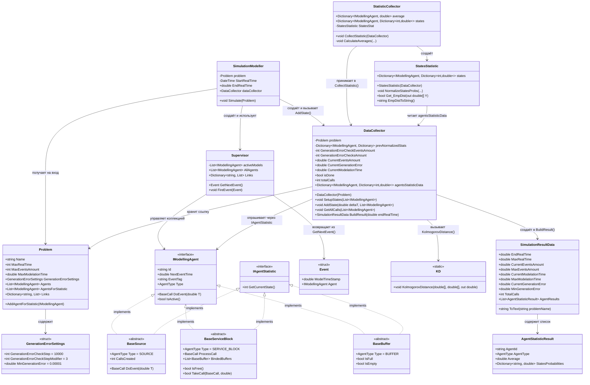

# Диаграмма классов: Подсистема сбора данных

## Mermaid-диаграмма



---

## Текстовое описание связей

```
SimulationModeller
  ├── владеет ──► DataCollector        (создаёт в Simulate(), вызывает AddState на каждом событии)
  ├── владеет ──► Supervisor           (планировщик, выдаёт события)
  └── получает ─► Problem              (конфигурация задачи)

DataCollector
  ├── хранит ссылку ─► Problem         (для параметров остановки и GenerationErrorSettings)
  ├── опрашивает ────► IAgentStatistic  (GetCurrentState() у каждого агента)
  ├── использует ────► KD              (расстояние Колмогорова для оценки погрешности)
  └── создаёт ──────► SimulationResultData  (итоговый результат в BuildResult())

StatisticCollector (альтернативный путь обработки)
  ├── принимает ─► DataCollector        (читает agentsStatisticData)
  └── создаёт ──► StatesStatistic       (нормализация, эмпирическое распределение)

SimulationResultData
  └── содержит ─► List<AgentStatisticResult>  (статистика по каждому агенту)
```

---

## Роли классов

| Класс | Роль в подсистеме |
|-------|-------------------|
| `SimulationModeller` | **Оркестратор** — запускает цикл, связывает планировщик и коллектор |
| `Supervisor` | **Планировщик событий** — выбирает ближайшее событие, исполняет его |
| `DataCollector` | **Коллектор** — накапливает сырые данные (время в состояниях), проверяет сходимость, формирует итог |
| `StatisticCollector` | **Процессор** — альтернативная обработка (средние, ковариации) |
| `StatesStatistic` | **Нормализатор** — делит время на общее, даёт вероятности |
| `KD` | **Утилита** — вычисление расстояния Колмогорова |
| `IAgentStatistic` | **Контракт** — единственный метод `GetCurrentState()`, позволяет коллектору не зависеть от конкретных агентов |
| `SimulationResultData` | **DTO результата** — структурированный итог для сохранения в БД |
