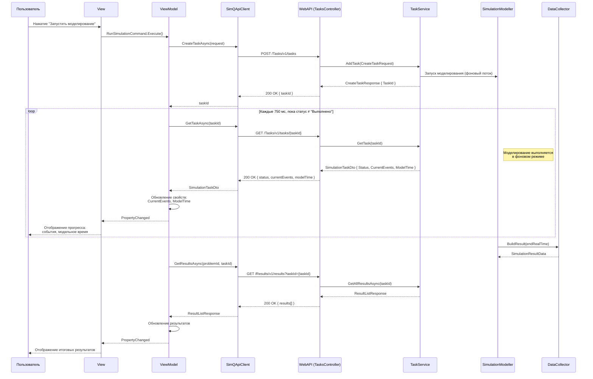

# Диаграмма последовательности: Запуск и мониторинг моделирования

## Описание этапов

### 1. Инициация запуска моделирования
Пользователь через View инициирует команду запуска. ViewModel отправляет `POST`-запрос на создание задачи. Сервер возвращает уникальный идентификатор (`taskId`) процесса моделирования, переводя задачу в состояние исполнения в фоновом режиме.

### 2. Циклический опрос состояния (Polling)
После получения `taskId` клиент переходит в режим циклического опроса с интервалом **750 мс**. На каждой итерации выполняется `GET`-запрос для получения актуального статуса. Полученные данные — текущее количество событий и модельное время — отображаются в интерфейсе через механизм привязки данных (`INotifyPropertyChanged`).

### 3. Завершение моделирования
Когда `DataCollector.isDone` становится `true` (достигнут лимит событий, модельного времени или ошибки генерации), `SimulationModeller` формирует итоговый результат через `BuildResult()`.

### 4. Получение детальных результатов
Как только статус задачи меняется на "Выполнено", цикл опроса прекращается. Клиент выполняет финальный запрос на получение детальных результатов моделирования из подсистемы сбора данных.
